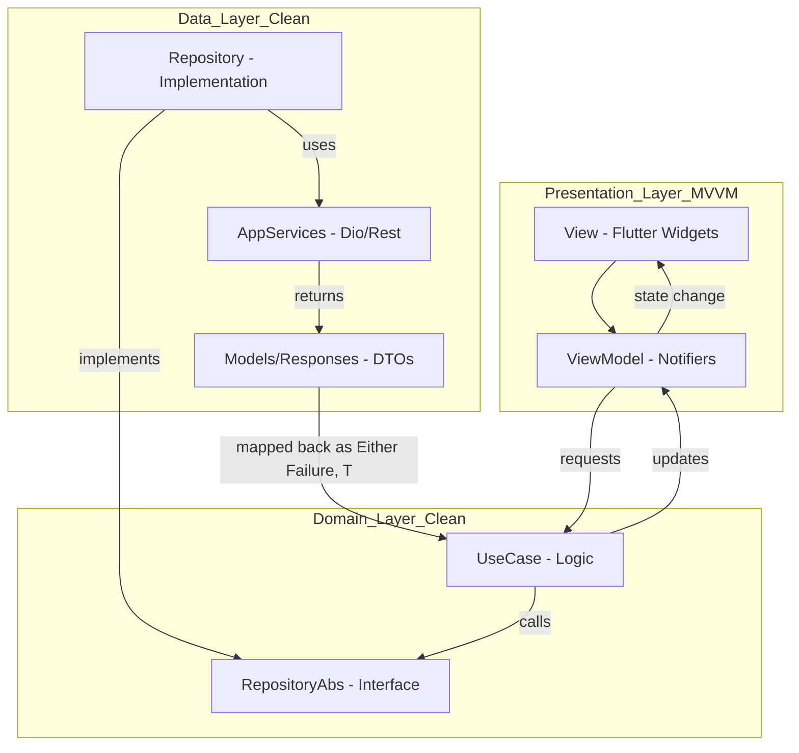

# Project Architecture Guide

This project follows a hybrid **MVVM + Clean Architecture** pattern. This structure ensures a strict separation of concerns, making the app highly testable and scalable.

## 1. Architectural Layers

---

## 2. Detailed Layer Breakdown

### 📂 Presentation Layer (`lib/presentation`)
This layer handles everything the user sees and interacts with.
- **Views (`/views`)**: Pure Flutter widgets. They are "dumb" and only listen to state changes from providers.
- **ViewModels (`/riverpod`)**: Implemented using Riverpod `Notifier` or `StateNotifier`. They manage UI state and handle user events by calling UseCases.
- **Resources (`/res`)**: Contains centralized managers for colors, assets, fonts, routes, and translations.

### 📂 Domain Layer (`lib/domain`)
The core of the application. It contains the business rules and is independent of any external frameworks (except `dartz` for functional error handling).
- **UseCases (`/usecase`)**: Classes that implement a single task (e.g., `AuthInitUseCase`). They depend only on Repository interfaces.
- **Repository Interfaces (`/repository`)**: Abstract classes defining the contract for data operations.
- **Models (`/model`)**: Pure Dart entities used for business logic.

### 📂 Data Layer (`lib/data`)
Handles data retrieval from remote (APIs) or local sources.
- **Repository Implementations (`/repository`)**: Concrete implementations of the Domain interfaces.
- **Network (`/network`)**: Contains Dio configuration, `DioFactory`, and the **`fastHandler`** for standardized error processing.
- **Responses/Requests**: DTOs (Data Transfer Objects) that handle JSON serialization/deserialization.

---

## 3. Core Architectural Patterns

### 🛠️ Dependency Injection (DI)
Located in `lib/app/di/dependency_injection.dart`.
We use a centralized `DI` class powered by Riverpod's `ProviderContainer`. This allows for:
- Manual injection in non-widget classes.
- Easy overriding of dependencies for testing.
- Global access to core services like `StorageService` `LoadingManager` and `SnackbarHelper`.

### 🛡️ Functional Error Handling
We use the **`dartz`** package to handle errors in a functional way:
- **`Either<Failure, Success>`**: Every repository and usecase returns an `Either` type.
- **`fastHandler`**: A utility in the Data layer that catches Dio/Server errors and wraps them in a `Failure` object (`Left`) or returns the data (`Right`).

### 🔄 Unidirectional Data Flow
1. **User Action**: Click button in `View`.
2. **Intent**: `View` calls `ViewModel.action()`.
3. **Logic**: `ViewModel` calls `UseCase.execute()`.
4. **Data**: `UseCase` gets `Either<Failure, T>` from `Repository`.
5. **State**: `ViewModel` updates its state based on the result.
6. **Rebuild**: `View` reacts to the new state and updates the UI.

---

## 🚀 Feature Documentation
For implementation details on specific app features, see:
- **[Authentication Flow](./presentation/AUTH.md)**
- **[Onboarding Flow](./presentation/ONBOARDING.md)**
